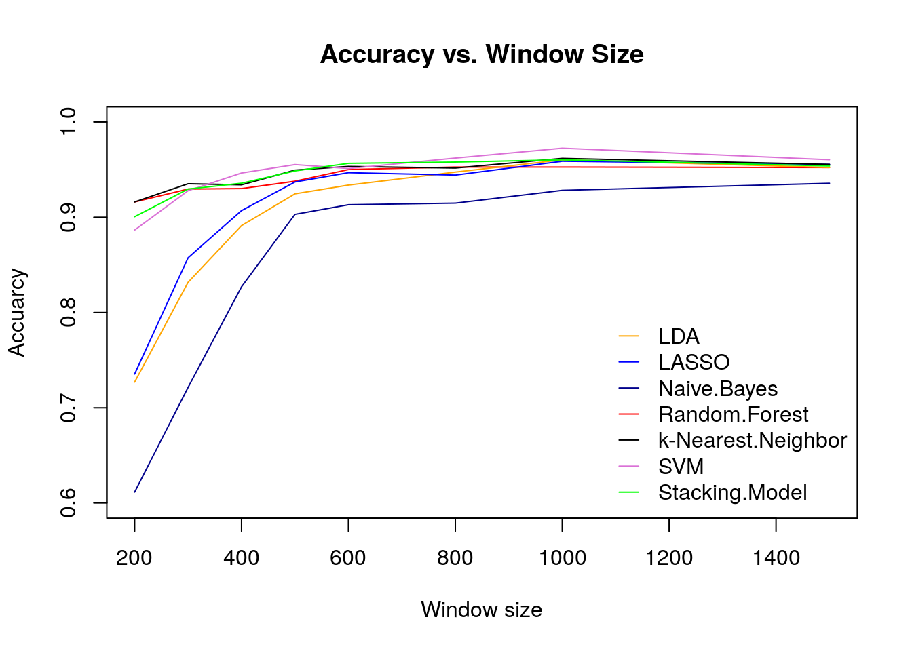
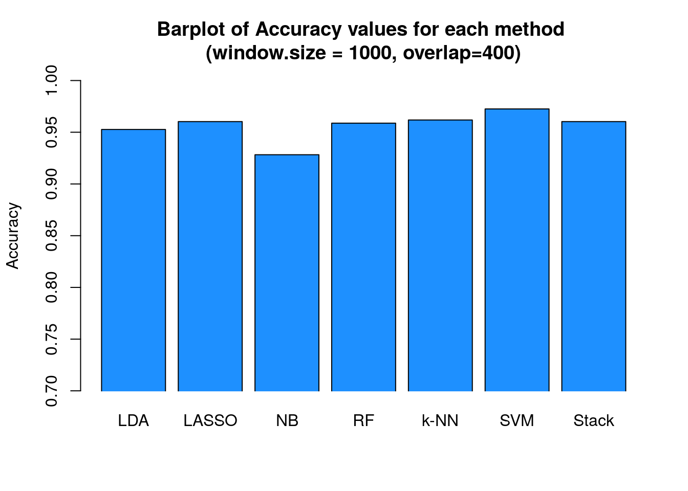

# Walking-Pattern-Recognition
Statistical Learning Project (Sapienza University of Rome)

## Abstract

Classification is a fascinating world, full of things to discover and much more interesting if we can analyse
data generated by ourselves.

We have heard that as human beings we are unique, but...Will it be possible that these differences can be
detected even by a simple cell phone sensor, administered by an application designed to help young people
make better science school projects?

Our interest is to test if we are able to classify the way of walking of each one of the members of this group,
this would mean that each one of us has a unique and special way of walking and that alone would be an
interesting result.

## Data Collection

We collected all the data using Science Journal App during 25 minutes walking. As result we have 5 csv. files, one for each group member. 

Each csv. contains the values of:

* Relative time: each row represents a millisecond.
* Linear Accelerometer Sensor
* Acceleration on the x axis
* Acceleration on the y axis
* Acceleration on the z axis

## Goals

* Classification
* Multiresolution Analysis

## Features Extraction

In order to extract the features from the sequences of observations we used a technique of window overlap. In this technique, we divide a dataset into smaller sets such that each window has the same size controlled by parameters **window.size** and **overlap**. We tried different parameters to compare the performance of our models. 

We generated the following features:

* Average acceleration for each axis and linear acceleration
* Standard deviation for each axis and linear acceleration
* Average Absolute Difference

## Modeling

Used algorithms:

* Random Forest
* Linear Discriminant Analysis
* Naive Bayes (parametric)
* LASSO Logistic Regression 
* k-Nearest Neighbours
* SVM
* Stacking Model from the best 4 models

## A few interesting results

## Technology
R packages:

* randomForest
* caret
* MASS
* e1071
* doParallel
* corrplot
* glmnet
* ggplot2
